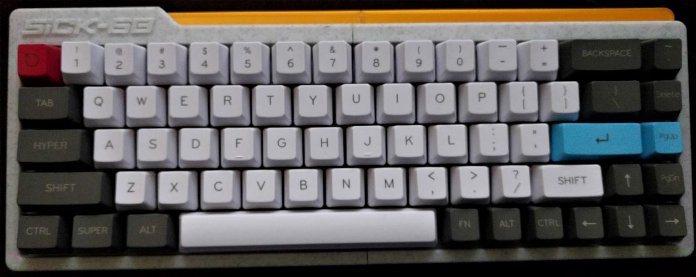

## About
This repo contains teensy 3.2 firmware for a 3d-printed sick-68 keyboard, which can be found on [Thingiverse](https://www.thingiverse.com/thing:3478494).

Keycaps, switches, and electronics are from Amazon - I printed the case on an ender 3.  This project uses a teensy 3.2 for the controller, Cherry MX Browns for the switches, and a 68-key keycap set.

## Why write custom firmware (why not EasyAVR)?
Fun!  Also, I used an asus eee pc keyboard for a while, and found it to be fully functional despite being roughly half the size of a keyboard with a numpad.  This firmware takes a lot of the fn-chording ideas from the eee pc keyboard, and maps them to the sick-68.

## FN keys
With no modifiers, all keys work as labeled.  The fn keys change the behavior of some of the keys

| FN + <key> | Action |
|------------|--------|
| left arrow | home |
| right arrow | end |
| up arrow | page up |
| down arrow | page down |
| 1-0, -, + | F1-12 |
| backtick | play/pause |
| delete | mute |
| page up | volume up |
| page down | volume down |
| comma | previous track |
| period | next track |
| slash | stop |
